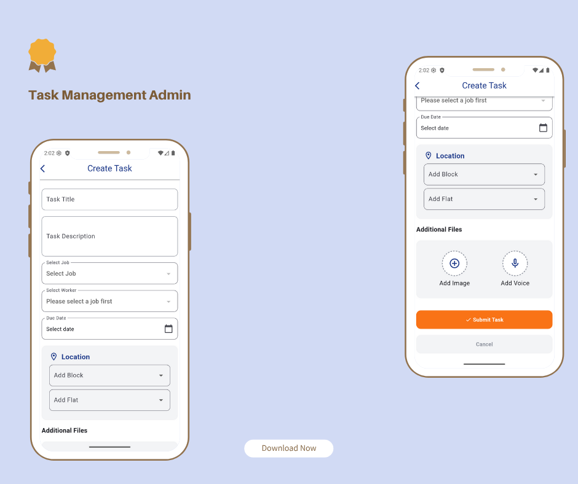
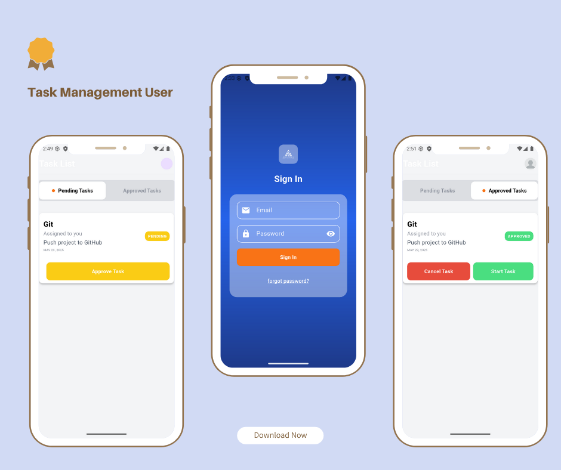
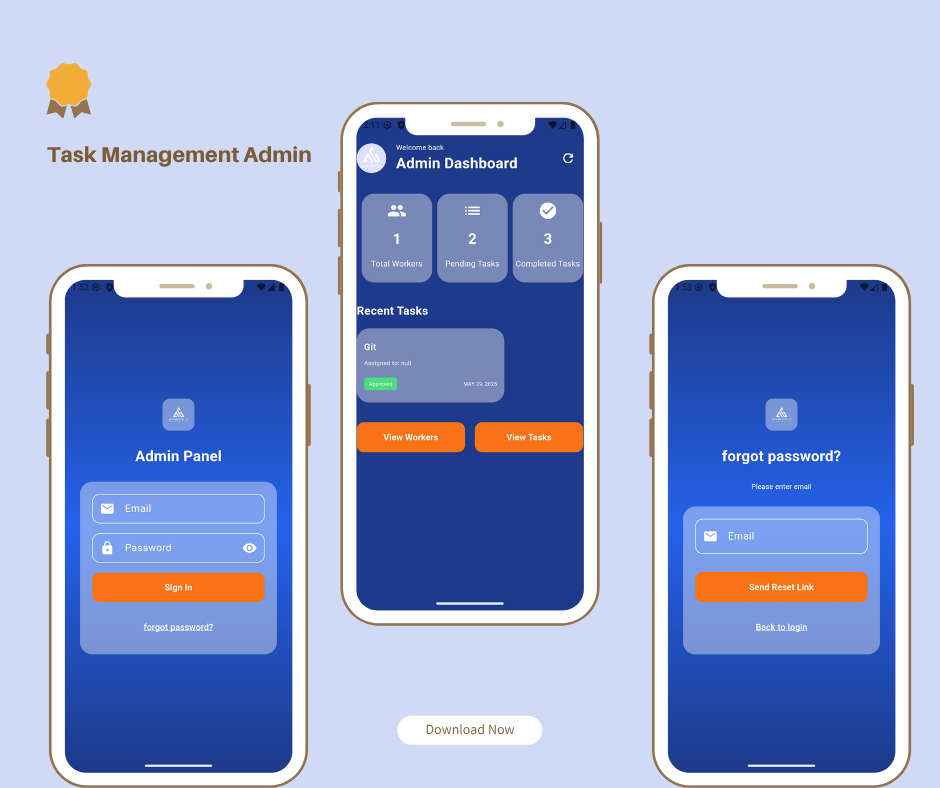
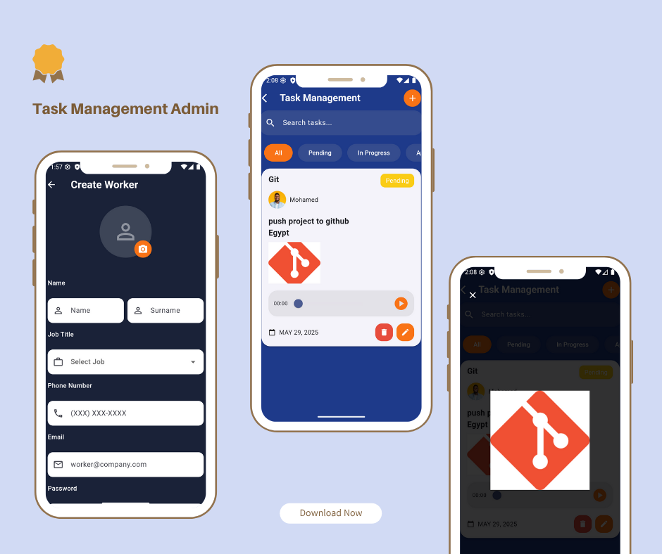

# Task Management App

Manage your team's tasks efficiently with real-time updates, voice notes, and full control for Admin and Workers.

---

## Features Overview

|  |  |
|:----------------------------------------------:|:--------------------------------------------:|
| **Admin Panel**                                | **Worker Panel**                             |
| - Create, update, delete workers               | - Cancel, approve, complete tasks            |
| - Create, update, delete tasks                  |                                              |
| - Add images and voice notes to tasks           |                                              |
| - Follow task status: In Progress, Canceled, Approved, Done |                                      |

---

|  |  |
|:-----------------------------------------:|:-----------------------------------------------:|
| **Authentication**                        | **Task Status Tracking**                         |
| - Separate auth for Admin & Worker apps   | - Monitor tasks progress & status                |
| - Secure login and access control          | - Real-time status updates                         |

---

## User Base

- Supports multiple workers with roles and permissions.
- Length of user list can be managed efficiently.

---

